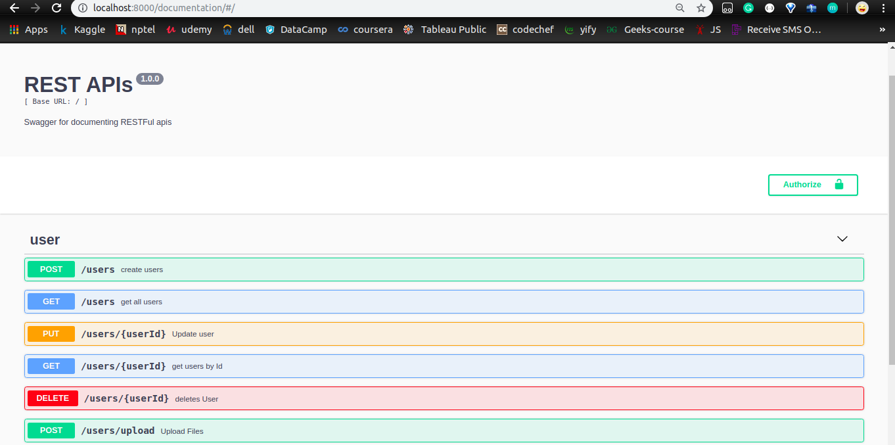
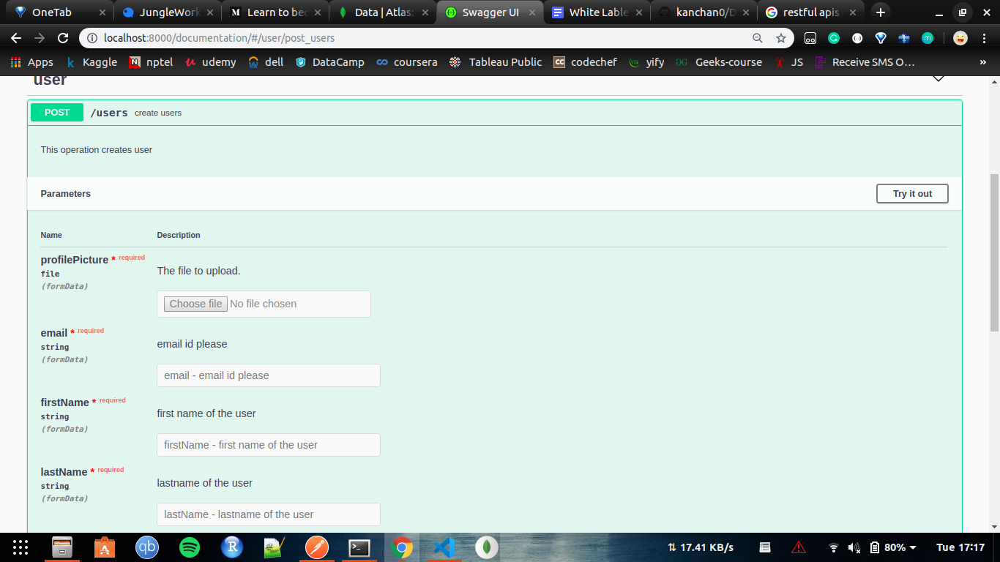
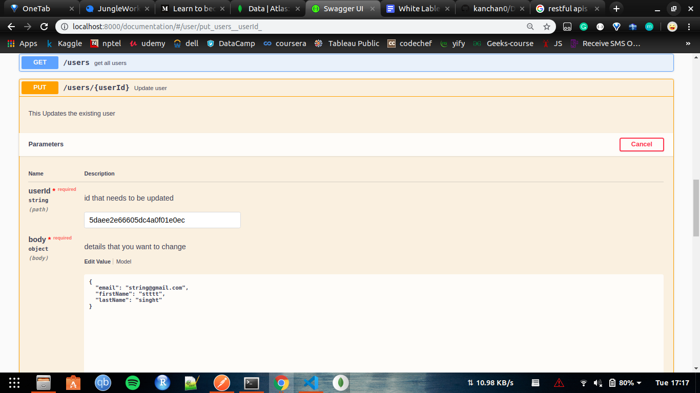

##### 
## :heart: Star :heart: the repo to support the project or :smile:[Follow Me](https://github.com/kanchan0).Thanks!

# Documentation_Using_swagger
A express app to show to do proper documentation of RESTful APIs using swagger.
Swagger allows you to describe the structure of your APIs so that machines can read them. The ability of APIs
to describe their own structure is the root of all awesomeness in Swagger.
for futher details vist the link https://swagger.io/docs/specification/2-0/what-is-swagger/

#### To get started follow the steps 
##### 1. clone the project `git clone git@github.com:kanchan0/Documentation_Using_swagger.git`
##### 2. Make a folder in root directory named config and a file name keys.js inside it
         This file contains the detail of the database connectivity. Give the details in
         the following format
         
         module.exports={
            MONGO_URI:'Mngodb uri to connect'
         }
         
##### 3. run "npm install" to download all the dependencies
##### 4. Run the project by "nodemon app.js" or "node app.js"
##### 5.open browser and visit "http://localhost:8000/documentation"

#### Snapshot of the documentation you get.

This is the home page where you can see all the apis you have created and can test by expanding them.
###
###

After expanding the api for url 'localhost:8000/users', you will get the above view.
To test it just click on `try it out` and fill the required details and click on execute.
###
###

This is for modifying details of the created user by providing details you want to change.

